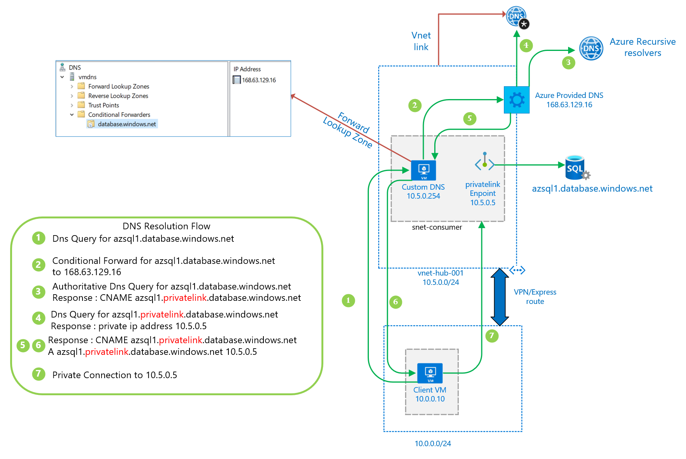

# Private Link DNS integration scenarios

DNS is a critical component to make private link endpoints work correctly within a solution.
This article is oriented to guide you on how to get the dns resolution integrated in different scenarios with private link endpoints.

  
## Guidance workflow 
 
 Use this workflow to get to the correct scenario that can guide you to integrate the name resolution of private link endpoints in your solution
 
 

 > [!NOTE]
> you will see particular examples with Azure SQL as the integrated service, but the guidance applies to any other Azure service that has integrated the private link endpoint .

## 1. Single VNET and Custom DNS

In this scenario the client vm resolves the private link endpoint via a custom dns that is in the same VNET. 

This custom dns has a conditional forwarder to the general zone database.windows.net pointing to ([168.63.129.16](https://docs.microsoft.com/en-us/azure/virtual-network/what-is-ip-address-168-63-129-16)) that makes the authoritative resolution and queries the azure private dns zone for the required record. 

## 2. Hub & Spoke with Custom DNS

In this scenario there's a [hub & spoke](https://docs.microsoft.com/en-us/azure/architecture/reference-architectures/hybrid-networking/hub-spoke) networking topology , with the spoke networks sharing a common custom dns that is deployed in the hub VNET.

In the spoke VNET, the dns configuration is pointing to the hub custom dns (10.5.0.254)

This custom dns (10.5.0.254) has a conditional forwarder to the general zone database.windows.net pointing to ([168.63.129.16](https://docs.microsoft.com/en-us/azure/virtual-network/what-is-ip-address-168-63-129-16)) that makes the authoritative resolution and queries the azure private dns zone for the required record. 

## 3. On-Prem forward to Azure

This scenario corresponds to an on-premise network that has its internal dns solution (10.0.0.254) that forwards dns traffic via a conditional forwarder for the general zone database.windows.net and chains up the dns resolution to the custom dns (10.5.0.254) deployed in Azure.

## 4. On-Prem direct resolution

This scenario shows an internal on-prem dns that resolves directly the private link endpoint, with an A dns record pointing to the IP in Azure (10.5.0.5)

## 5. On-Prem with no DNS and forwarding to Azure

This scenario shows an on-prem network with no local dns solution , that forwards the request to a custom DNS (10.5.0.254) deployed in Azure.

## 6. Single VNET and Azure Provided DNS

This an Azure only scenario where the client queries for the private link endpoint IP to Azure provided dns [168.63.129.16](https://docs.microsoft.com/en-us/azure/virtual-network/what-is-ip-address-168-63-129-16) that makes the authoritative resolution and queries the azure private dns zone for the required record.

## 7. Hub and Spoke with Azure provided DNS

In this scenario there's a [hub & spoke](https://docs.microsoft.com/en-us/azure/architecture/reference-architectures/hybrid-networking/hub-spoke) networking topology , with the spoke networks sharing a common private link endpoint and all the spoke VNET are linked to the same private dns zone. 

## 8. Hybrid Scenario

This scenario shows:

- on-premise network that has its internal dns solution (10.0.0.254) that forwards dns traffic via a conditional forwarder for the general zone database.windows.net and chains up the dns resolution to the custom dns (10.5.0.254) deployed in Azure.

- spoke vnet (vnet-spoke-eastus-001) sharing a private link endpoint and private dns zone

- spoke vnet (vnet-spoke-westus-001) in another region reaching locally the private link endpoint (10.20.0.5)

> [!NOTE]
> Notice the use of different private dns zones for non connected vnets, you may get undesired results if you use the same private dns zone.

